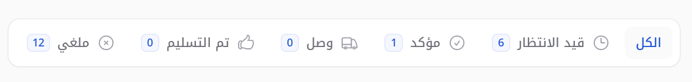

# Add tabs according to the casts class of the status column (or column specifiy by you)

[](https://packagist.org/packages/ht3aa/status-tabs)
[](https://packagist.org/packages/ht3aa/status-tabs)



## Installation

You can install the package via composer:

```bash
composer require ht3aa/status-tabs
```


## Usage

This package provides a `StatusTabs` class that automatically generates tabs in your Filament resource list page based on the status enum of your model.

### Requirements

1. Your model must have a `status` column cast to an enum class
2. Your enum class must implement `getLabel()` and `getIcon()` methods

### Example Enum

```php
<?php

namespace App\Enums;

enum OrderStatus: string
{
    case PENDING = 'pending';
    case PROCESSING = 'processing';
    case COMPLETED = 'completed';
    case CANCELLED = 'cancelled';

    public function getLabel(): string
    {
        return match($this) {
            self::PENDING => 'Pending',
            self::PROCESSING => 'Processing',
            self::COMPLETED => 'Completed',
            self::CANCELLED => 'Cancelled',
        };
    }

    public function getIcon(): string
    {
        return match($this) {
            self::PENDING => 'heroicon-o-clock',
            self::PROCESSING => 'heroicon-o-arrow-path',
            self::COMPLETED => 'heroicon-o-check-circle',
            self::CANCELLED => 'heroicon-o-x-circle',
        };
    }
}
```

### Example Model

```php
<?php

namespace App\Models;

use App\Enums\OrderStatus;
use Illuminate\Database\Eloquent\Model;

class Order extends Model
{
    protected $casts = [
        'status' => OrderStatus::class,
    ];
}
```

### Using in Filament Resource

In your Filament resource's list page, extend `StatusTabs` instead of `ListRecords`:

```php
<?php

namespace App\Filament\Resources\OrderResource\Pages;

use App\Filament\Resources\OrderResource;
use Ht3aa\StatusTabs\StatusTabs;
use Filament\Actions;
use Filament\Resources\Pages\ListRecords;

class ListOrders extends StatusTabs
{
    protected static string $resource = OrderResource::class;

    protected function getHeaderActions(): array
    {
        return [
            Actions\CreateAction::make(),
        ];
    }
}
```

The `StatusTabs` class will automatically:
- Create an "All" tab showing all records
- Create a tab for each status enum case
- Display the status label, icon, and count badge for each tab
- Filter records by status when a tab is selected

## Testing

```bash
composer test
```

## Changelog

Please see [CHANGELOG](CHANGELOG.md) for more information on what has changed recently.

## Contributing

Please see [CONTRIBUTING](.github/CONTRIBUTING.md) for details.

## Security Vulnerabilities

Please review [our security policy](../../security/policy) on how to report security vulnerabilities.

## Credits

- [Hasan Tahseen](https://github.com/ht3aa)
- [All Contributors](../../contributors)

## License

The MIT License (MIT). Please see [License File](LICENSE.md) for more information.
